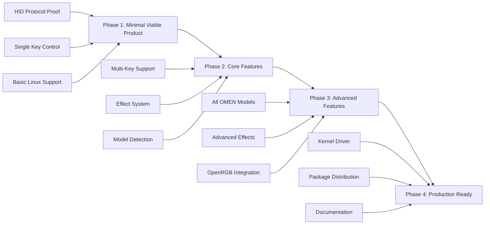

# OMEN Klavye Prototip İmplementasyon Planı

## 🎯 Prototip Geliştirme Stratejisi

### Aşamalı Geliştirme Yaklaşımı



## 📋 Phase 1: Minimal Viable Product (MVP)

### Hedefler
- HID protokolünün temel çalışmasını kanıtlamak
- Tek tuş renk değiştirme yeteneği
- Linux'ta temel HID erişimi

### Deliverables

#### 1.1 HID Protocol Analyzer
```python
#!/usr/bin/env python3
# omen_hid_analyzer.py - HID protokol analiz aracı

import hid
import struct
import time
import argparse
from typing import List, Tuple, Optional

class OmenHIDAnalyzer:
    """OMEN HID protokolünü analiz etmek için araç"""
    
    def __init__(self, vendor_id: int = 0x03f0):
        self.vendor_id = vendor_id
        self.device = None
        self.test_results = []
    
    def find_omen_devices(self) -> List[dict]:
        """OMEN cihazlarını bul ve listele"""
        devices = hid.enumerate(self.vendor_id)
        omen_devices = []
        
        for device_info in devices:
            product = device_info.get('product_string', '').lower()
            if 'omen' in product or 'keyboard' in product:
                omen_devices.append(device_info)
                print(f"Found OMEN device: {device_info['product_string']}")
                print(f"  VID: 0x{device_info['vendor_id']:04X}")
                print(f"  PID: 0x{device_info['product_id']:04X}")
                print(f"  Path: {device_info['path']}")
        
        return omen_devices
    
    def connect_device(self, product_id: Optional[int] = None) -> bool:
        """Cihaza bağlan"""
        try:
            if product_id:
                self.device = hid.device()
                self.device.open(self.vendor_id, product_id)
            else:
                # İlk bulunan OMEN cihazını kullan
                devices = self.find_omen_devices()
                if not devices:
                    print("No OMEN devices found!")
                    return False
                
                self.device = hid.device()
                self.device.open_path(devices[0]['path'])
            
            print(f"Connected to: {self.device.get_product_string()}")
            return True
            
        except Exception as e:
            print(f"Connection failed: {e}")
            return False
    
    def test_basic_report(self) -> bool:
        """Temel HID report testi"""
        if not self.device:
            return False
        
        # Diagramdan bilinen format: Report ID 0x02, 65 byte
        test_report = bytearray(65)
        test_report[0] = 0x02  # Report ID
        test_report[1] = 0x01  # SET_STATIC command (tahmin)
        test_report[2] = 0x01  # Key count
        test_report[3] = 0x00  # Flags
        
        # Test key: A tuşu (tahmin edilen format)
        test_report[4] = 0x00  # Key ID byte 1
        test_report[5] = 0x00  # Key ID byte 2  
        test_report[6] = 0x1E  # Key ID byte 3 (A key scancode)
        test_report[7] = 0xFF  # Red
        test_report[8] = 0x00  # Green
        test_report[9] = 0x00  # Blue
        
        try:
            result = self.device.send_feature_report(test_report)
            print(f"Basic report test: {'SUCCESS' if result > 0 else 'FAILED'}")
            return result > 0
        except Exception as e:
            print(f"Basic report test failed: {e}")
            return False
    
    def test_key_positions(self) -> List[Tuple[int, bool]]:
        """Farklı key pozisyonlarını test et"""
        test_keys = [
            (0x1E, "A"),      # A key
            (0x1A, "W"),      # W key  
            (0x1F, "S"),      # S key
            (0x20, "D"),      # D key
            (0x2C, "Space"),  # Space
            (0x28, "Enter"),  # Enter
        ]
        
        results = []
        
        for key_code, key_name in test_keys:
            print(f"Testing key: {key_name} (0x{key_code:02X})")
            
            # RGB test colors
            colors = [(255, 0, 0), (0, 255, 0), (0, 0, 255)]
            
            for r, g, b in colors:
                success = self.send_key_color(key_code, r, g, b)
                results.append((key_code, success))
                
                if success:
                    print(f"  {key_name} RGB({r},{g},{b}): SUCCESS")
                    time.sleep(0.5)  # Görsel doğrulama için bekle
                else:
                    print(f"  {key_name} RGB({r},{g},{b}): FAILED")
        
        return results
    
    def send_key_color(self, key_code: int, r: int, g: int, b: int) -> bool:
        """Tek tuş rengi gönder"""
        if not self.device:
            return False
        
        report = bytearray(65)
        report[0] = 0x02  # Report ID
        report[1] = 0x01  # SET_STATIC command
        report[2] = 0x01  # Key count
        report[3] = 0x00  # Flags
        
        # Key data - format needs to be determined
        report[4] = 0x00           # Key ID byte 1
        report[5] = 0x00           # Key ID byte 2
        report[6] = key_code       # Key ID byte 3
        report[7] = r              # Red
        report[8] = g              # Green
        report[9] = b              # Blue
        
        try:
            result = self.device.send_feature_report(report)
            return result > 0
        except Exception as e:
            print(f"Send key color failed: {e}")
            return False
    
    def protocol_fuzzing(self, iterations: int = 100) -> None:
        """Protokol fuzzing testi"""
        print(f"Starting protocol fuzzing ({iterations} iterations)...")
        
        successful_reports = []
        
        for i in range(iterations):
            report = bytearray(65)
            report[0] = 0x02  # Report ID sabit
            
            # Random command ve parametreler
            report[1] = random.choice([0x01, 0x02, 0x03, 0x04])  # Command
            report[2] = random.randint(1, 5)                      # Key count
            report[3] = random.randint(0, 255)                    # Flags
            
            # Random key data
            for j in range(4, 64):
                report[j] = random.randint(0, 255)
            
            try:
                result = self.device.send_feature_report(report)
                if result > 0:
                    successful_reports.append(report.copy())
                    print(f"Fuzzing iteration {i}: SUCCESS")
            except:
                pass
        
        print(f"Fuzzing complete. {len(successful_reports)} successful reports.")
        return successful_reports
    
    def disconnect(self) -> None:
        """Cihaz bağlantısını kes"""
        if self.device:
            self.device.close()
            self.device = None

def main():
    parser = argparse.ArgumentParser(description='OMEN HID Protocol Analyzer')
    parser.add_argument('--pid', type=lambda x: int(x, 16), 
                       help='Product ID (hex format, e.g., 0x1234)')
    parser.add_argument('--test-keys', action='store_true',
                       help='Test different key positions')
    parser.add_argument('--fuzz', type=int, metavar='N',
                       help='Run protocol fuzzing with N iterations')
    
    args = parser.parse_args()
    
    analyzer = OmenHIDAnalyzer()
    
    # Cihaza bağlan
    if not analyzer.connect_device(args.pid):
        return 1
    
    try:
        # Temel test
        print("\n=== Basic HID Report Test ===")
        analyzer.test_basic_report()
        
        # Key position testleri
        if args.test_keys:
            print("\n=== Key Position Tests ===")
            analyzer.test_key_positions()
        
        # Protocol fuzzing
        if args.fuzz:
            print(f"\n=== Protocol Fuzzing ({args.fuzz} iterations) ===")
            analyzer.protocol_fuzzing(args.fuzz)
    
    finally:
        analyzer.disconnect()
    
    return 0

if __name__ == "__main__":
    import sys
    import random
    sys.exit(main())
```

#### 1.2 Minimal Linux HID Tool
```c
// omen_minimal.c - Minimal OMEN HID control tool
#include <stdio.h>
#include <stdlib.h>
#include <string.h>
#include <unistd.h>
#include <fcntl.h>
#include <sys/ioctl.h>
#include <linux/hidraw.h>
#include <linux/input.h>

#define OMEN_VENDOR_ID 0x03f0
#define OMEN_REPORT_SIZE 65

struct omen_device {
    int fd;
    char path[256];
    __u16 vendor_id;
    __u16 product_id;
};

// Find OMEN HID device
int find_omen_device(struct omen_device *dev) {
    char device_path[256];
    int fd;
    struct hidraw_devinfo info;
    
    // Scan /dev/hidraw* devices
    for (int i = 0; i < 16; i++) {
        snprintf(device_path, sizeof(device_path), "/dev/hidraw%d", i);
        
        fd = open(device_path, O_RDWR);
        if (fd < 0) continue;
        
        if (ioctl(fd, HIDIOCGRAWINFO, &info) < 0) {
            close(fd);
            continue;
        }
        
        if (info.vendor == OMEN_VENDOR_ID) {
            printf("Found OMEN device: %s (VID: 0x%04X, PID: 0x%04X)\n",
                   device_path, info.vendor, info.product);
            
            dev->fd = fd;
            strcpy(dev->path, device_path);
            dev->vendor_id = info.vendor;
            dev->product_id = info.product;
            return 0;
        }
        
        close(fd);
    }
    
    return -1;
}

// Send HID report
int send_hid_report(struct omen_device *dev, const unsigned char *report, size_t size) {
    ssize_t ret = write(dev->fd, report, size);
    if (ret < 0) {
        perror("write");
        return -1;
    }
    
    if (ret != size) {
        fprintf(stderr, "Short write: %zd/%zu bytes\n", ret, size);
        return -1;
    }
    
    return 0;
}

// Set single key color
int set_key_color(struct omen_device *dev, unsigned char key_code, 
                  unsigned char r, unsigned char g, unsigned char b) {
    unsigned char report[OMEN_REPORT_SIZE] = {0};
    
    // Build HID report based on reverse engineering
    report[0] = 0x02;      // Report ID
    report[1] = 0x01;      // SET_STATIC command
    report[2] = 0x01;      // Key count
    report[3] = 0x00;      // Flags
    
    // Key data (format to be determined through testing)
    report[4] = 0x00;      // Key ID byte 1
    report[5] = 0x00;      // Key ID byte 2
    report[6] = key_code;  // Key ID byte 3
    report[7] = r;         // Red
    report[8] = g;         // Green
    report[9] = b;         // Blue
    
    return send_hid_report(dev, report, sizeof(report));
}

// Test different key codes
void test_key_codes(struct omen_device *dev) {
    struct {
        unsigned char code;
        const char *name;
    } test_keys[] = {
        {0x1E, "A"},
        {0x1A, "W"}, 
        {0x1F, "S"},
        {0x20, "D"},
        {0x2C, "Space"},
        {0x28, "Enter"},
        {0}
    };
    
    printf("Testing key codes...\n");
    
    for (int i = 0; test_keys[i].code; i++) {
        printf("Testing %s (0x%02X): ", test_keys[i].name, test_keys[i].code);
        
        // Test with red color
        if (set_key_color(dev, test_keys[i].code, 255, 0, 0) == 0) {
            printf("SUCCESS\n");
            sleep(1);
            
            // Turn off
            set_key_color(dev, test_keys[i].code, 0, 0, 0);
        } else {
            printf("FAILED\n");
        }
    }
}

int main(int argc, char *argv[]) {
    struct omen_device dev;
    
    printf("OMEN Minimal HID Tool\n");
    printf("=====================\n");
    
    // Find OMEN device
    if (find_omen_device(&dev) < 0) {
        fprintf(stderr, "No OMEN devices found\n");
        return 1;
    }
    
    if (argc >= 5) {
        // Manual key color setting
        unsigned char key = strtol(argv[1], NULL, 16);
        unsigned char r = atoi(argv[2]);
        unsigned char g = atoi(argv[3]);
        unsigned char b = atoi(argv[4]);
        
        printf("Setting key 0x%02X to RGB(%d,%d,%d)\n", key, r, g, b);
        
        if (set_key_color(&dev, key, r, g, b) == 0) {
            printf("SUCCESS\n");
        } else {
            printf("FAILED\n");
        }
    } else {
        // Run test sequence
        test_key_codes(&dev);
    }
    
    close(dev.fd);
    return 0;
}
```

#### 1.3 Build System
```makefile
# Makefile for OMEN MVP
CC = gcc
CFLAGS = -Wall -Wextra -O2 -std=c99
PYTHON = python3

# Targets
all: omen_minimal omen_analyzer

omen_minimal: omen_minimal.c
	$(CC) $(CFLAGS) -o $@ $<

omen_analyzer: omen_hid_analyzer.py
	chmod +x $<
	ln -sf $< $@

test: omen_minimal
	sudo ./omen_minimal

install: all
	install -d $(DESTDIR)/usr/local/bin
	install -m 755 omen_minimal $(DESTDIR)/usr/local/bin/
	install -m 755 omen_hid_analyzer.py $(DESTDIR)/usr/local/bin/omen-analyzer

clean:
	rm -f omen_minimal omen_analyzer

.PHONY: all test install clean
```

## 📋 Phase 2: Core Features

### Hedefler
- Çoklu tuş desteği
- Temel efekt sistemi
- Model detection
- Improved HID protocol understanding

### Deliverables

#### 2.1 Enhanced Protocol Library
```python
# omen_protocol.py - Enhanced protocol implementation
import struct
from typing import Dict, List, Tuple, Optional
from enum import IntEnum

class OmenCommand(IntEnum):
    SET_STATIC = 0x01
    SET_BREATHING = 0x02
    SET_WAVE = 0x03
    SET_REACTIVE = 0x04
    GET_STATUS = 0x10

class OmenKeyID(IntEnum):
    # Based on reverse engineering results
    ESC = 0x01
    F1 = 0x02
    # ... (to be filled from reverse engineering)
    A = 0x1E
    W = 0x1A
    S = 0x1F
    D = 0x20

class OmenModel(IntEnum):
    STARMADE = 0
    MODENA = 1
    RALPH = 2
    CYBUG = 3
    HENDRICKS = 4
    QUAKER_BRUNOBEAR = 5
    VOCO = 6
    DOJO_VIBRANCE = 7
    WOODSTOCK = 8

class OmenProtocol:
    """OMEN HID protocol implementation"""
    
    REPORT_ID = 0x02
    REPORT_SIZE = 65
    MAX_KEYS_PER_REPORT = 10
    
    def __init__(self):
        self.model_info = self._load_model_info()
        self.key_mappings = self._load_key_mappings()
    
    def _load_model_info(self) -> Dict[OmenModel, dict]:
        """Model-specific information"""
        return {
            OmenModel.STARMADE: {
                'name': 'OMEN Starmade',
                'product_id': 0x0001,
                'max_keys': 87,
                'zones': 4,
                'effects': [OmenCommand.SET_STATIC, OmenCommand.SET_BREATHING, OmenCommand.SET_WAVE]
            },
            # ... other models
        }
    
    def _load_key_mappings(self) -> Dict[OmenKeyID, Tuple[int, int, int]]:
        """Key ID to HID mapping (to be filled from reverse engineering)"""
        return {
            OmenKeyID.A: (0x00, 0x00, 0x1E),
            OmenKeyID.W: (0x00, 0x00, 0x1A),
            OmenKeyID.S: (0x00, 0x00, 0x1F),
            OmenKeyID.D: (0x00, 0x00, 0x20),
            # ... more mappings
        }
    
    def build_static_report(self, key_colors: List[Tuple[OmenKeyID, int, int, int]]) -> bytes:
        """Build static color HID report"""
        if len(key_colors) > self.MAX_KEYS_PER_REPORT:
            raise ValueError(f"Too many keys: {len(key_colors)} > {self.MAX_KEYS_PER_REPORT}")
        
        report = bytearray(self.REPORT_SIZE)
        offset = 0
        
        # Header
        report[offset] = self.REPORT_ID
        offset += 1
        report[offset] = OmenCommand.SET_STATIC
        offset += 1
        report[offset] = len(key_colors)
        offset += 1
        report[offset] = 0x00  # Flags
        offset += 1
        
        # Key data
        for key_id, r, g, b in key_colors:
            if key_id not in self.key_mappings:
                raise ValueError(f"Unknown key ID: {key_id}")
            
            hid_key = self.key_mappings[key_id]
            
            # 3-byte key identifier
            report[offset] = hid_key[0]
            report[offset + 1] = hid_key[1]
            report[offset + 2] = hid_key[2]
            offset += 3
            
            # RGB values
            report[offset] = r
            report[offset + 1] = g
            report[offset + 2] = b
            offset += 3
        
        return bytes(report)
    
    def build_breathing_report(self, color1: Tuple[int, int, int], 
                             color2: Tuple[int, int, int], speed: int) -> bytes:
        """Build breathing effect HID report"""
        report = bytearray(self.REPORT_SIZE)
        
        report[0] = self.REPORT_ID
        report[1] = OmenCommand.SET_BREATHING
        report[2] = 0x02  # Two colors
        report[3] = speed & 0xFF
        
        # Color 1
        report[4] = color1[0]
        report[5] = color1[1]
        report[6] = color1[2]
        
        # Color 2
        report[7] = color2[0]
        report[8] = color2[1]
        report[9] = color2[2]
        
        return bytes(report)
    
    def detect_model(self, product_id: int) -> Optional[OmenModel]:
        """Detect OMEN model from product ID"""
        for model, info in self.model_info.items():
            if info['product_id'] == product_id:
                return model
        return None
```

#### 2.2 Multi-Key Control Tool
```c
// omen_control.c - Multi-key control implementation
#include <stdio.h>
#include <stdlib.h>
#include <string.h>
#include <unistd.h>
#include <fcntl.h>
#include <getopt.h>
#include <json-c/json.h>

#define MAX_KEYS_PER_REPORT 10

struct key_effect {
    unsigned char key_id[3];  // 3-byte HID key ID
    unsigned char r, g, b;    // RGB values
};

struct omen_device {
    int fd;
    char path[256];
    unsigned short vendor_id;
    unsigned short product_id;
    char model_name[64];
};

// Load key mapping from JSON file
int load_key_mapping(const char *filename, struct key_effect *effects, int max_effects) {
    json_object *root, *keys_array, *key_obj;
    json_object *key_id_obj, *hid_key_obj, *color_obj;
    int count = 0;
    
    root = json_object_from_file(filename);
    if (!root) {
        fprintf(stderr, "Failed to load key mapping: %s\n", filename);
        return -1;
    }
    
    if (!json_object_object_get_ex(root, "keys", &keys_array)) {
        json_object_put(root);
        return -1;
    }
    
    int array_len = json_object_array_length(keys_array);
    
    for (int i = 0; i < array_len && count < max_effects; i++) {
        key_obj = json_object_array_get_idx(keys_array, i);
        
        if (json_object_object_get_ex(key_obj, "hid_key", &hid_key_obj) &&
            json_object_object_get_ex(key_obj, "color", &color_obj)) {
            
            json_object *hid_array = hid_key_obj;
            if (json_object_array_length(hid_array) == 3) {
                effects[count].key_id[0] = json_object_get_int(json_object_array_get_idx(hid_array, 0));
                effects[count].key_id[1] = json_object_get_int(json_object_array_get_idx(hid_array, 1));
                effects[count].key_id[2] = json_object_get_int(json_object_array_get_idx(hid_array, 2));
                
                json_object *r_obj, *g_obj, *b_obj;
                if (json_object_object_get_ex(color_obj, "r", &r_obj) &&
                    json_object_object_get_ex(color_obj, "g", &g_obj) &&
                    json_object_object_get_ex(color_obj, "b", &b_obj)) {
                    
                    effects[count].r = json_object_get_int(r_obj);
                    effects[count].g = json_object_get_int(g_obj);
                    effects[count].b = json_object_get_int(b_obj);
                    count++;
                }
            }
        }
    }
    
    json_object_put(root);
    return count;
}

// Send multi-key report
int send_multi_key_report(struct omen_device *dev, struct key_effect *effects, int count) {
    unsigned char report[65] = {0};
    int offset = 0;
    
    if (count > MAX_KEYS_PER_REPORT) {
        fprintf(stderr, "Too many keys: %d > %d\n", count, MAX_KEYS_PER_REPORT);
        return -1;
    }
    
    // Build report
    report[offset++] = 0x02;    // Report ID
    report[offset++] = 0x01;    // SET_STATIC command
    report[offset++] = count;   // Key count
    report[offset++] = 0x00;    // Flags
    
    for (int i = 0; i < count; i++) {
        // Key ID (3 bytes)
        report[offset++] = effects[i].key_id[0];
        report[offset++] = effects[i].key_id[1];
        report[offset++] = effects[i].key_id[2];
        
        // RGB values
        report[offset++] = effects[i].r;
        report[offset++] = effects[i].g;
        report[offset++] = effects[i].b;
    }
    
    ssize_t ret = write(dev->fd, report, sizeof(report));
    if (ret != sizeof(report)) {
        perror("write");
        return -1;
    }
    
    return 0;
}

void print_usage(const char *prog_name) {
    printf("Usage: %s [OPTIONS]\n", prog_name);
    printf("Options:\n");
    printf("  -f, --file FILE     Load key configuration from JSON file\n");
    printf("  -k, --key KEY       Set single key (format: key_id:r,g,b)\n");
    printf("  -a, --all COLOR     Set all keys to color (format: r,g,b)\n");
    printf("  -l, --list          List available devices\n");
    printf("  -h, --help          Show this help\n");
}

int main(int argc, char *argv[]) {
    struct omen_device dev;
    struct key_effect effects[MAX_KEYS_PER_REPORT];
    int effect_count = 0;
    
    static struct option long_options[] = {
        {"file", required_argument, 0, 'f'},
        {"key", required_argument, 0, 'k'},
        {"all", required_argument, 0, 'a'},
        {"list", no_argument, 0, 'l'},
        {"help", no_argument, 0, 'h'},
        {0, 0, 0, 0}
    };
    
    int opt;
    while ((opt = getopt_long(argc, argv, "f:k:a:lh", long_options, NULL)) != -1) {
        switch (opt) {
            case 'f':
                effect_count = load_key_mapping(optarg, effects, MAX_KEYS_PER_REPORT);
                if (effect_count < 0) {
                    fprintf(stderr, "Failed to load key mapping\n");
                    return 1;
                }
                break;
                
            case 'k':
                // Parse single key: key_id:r,g,b
                // Implementation needed
                break;
                
            case 'a':
                // Set all keys to same color
                // Implementation needed
                break;
                
            case 'l':
                // List devices
                // Implementation needed
                break;
                
            case 'h':
                print_usage(argv[0]);
                return 0;
                
            default:
                print_usage(argv[0]);
                return 1;
        }
    }
    
    // Find and connect to device
    if (find_omen_device(&dev) < 0) {
        fprintf(stderr, "No OMEN devices found\n");
        return 1;
    }
    
    // Send effects
    if (effect_count > 0) {
        printf("Sending %d key effects...\n", effect_count);
        if (send_multi_key_report(&dev, effects, effect_count) == 0) {
            printf("SUCCESS\n");
        } else {
            printf("FAILED\n");
        }
    }
    
    close(dev.fd);
    return 0;
}
```

## 📋 Phase 3: Advanced Features

### Hedefler
- Tüm OMEN modellerinin desteği
- Gelişmiş efektler (breathing, wave, reactive)
- OpenRGB entegrasyonu
- Performance optimizations

### Deliverables

#### 3.1 OpenRGB Plugin
```cpp
// OpenRGBOmenController.cpp
#include "OpenRGBOmenController.h"
#include <cstring>
#include <iostream>

OpenRGBOmenController::OpenRGBOmenController(hid_device* dev, const char* path, uint16_t pid)
{
    device = dev;
    location = path;
    product_id = pid;
    
    // Detect model
    model_info = DetectModel(pid);
    if (!model_info) {
        throw std::runtime_error("Unsupported OMEN model");
    }
    
    // Initialize device info
    device_name = model_info->name;
    device_type = DEVICE_TYPE_KEYBOARD;
    
    // Setup modes
    SetupModes();
    
    // Setup zones and LEDs
    SetupZones();
}

void OpenRGBOmenController::SetupModes()
{
    mode static_mode;
    static_mode.name = "Static";
    static_mode.value = OMEN_MODE_STATIC;
    static_mode.flags = MODE_FLAG_HAS_PER_LED_COLOR;
    static_mode.color_mode = MODE_COLORS_PER_LED;
    modes.push_back(static_mode);
    
    if (model_info->supports_breathing) {
        mode breathing_mode;
        breathing_mode.name = "Breathing";
        breathing_mode.value = OMEN_MODE_BREATHING;
        breathing_mode.flags = MODE_FLAG_HAS_SPEED | MODE_FLAG_HAS_MODE_SPECIFIC_COLOR;
        breathing_mode.colors_min = 1;
        breathing_mode.colors_max = 2;
        breathing_mode.speed_min = 1;
        breathing_mode.speed_max = 5;
        breathing_mode.color_mode = MODE_COLORS_MODE_SPECIFIC;
        modes.push_back(breathing_mode);
    }
    
    if (model_info->supports_wave) {
        mode wave_mode;
        wave_mode.name = "Wave";
        wave_mode.value = OMEN_MODE_WAVE;
        wave_mode.flags = MODE_FLAG_HAS_SPEED | MODE_FLAG_HAS_DIRECTION_LR;
        wave_mode.speed_min = 1;
        wave_mode.speed_max = 5;
        wave_mode.color_mode = MODE_COLORS_NONE;
        modes.push_back(wave_mode);
    }
}

void OpenRGBOmenController::SetupZones()
{
    // Main keyboard zone
    zone keyboard_zone;
    keyboard_zone.name = "Keyboard";
    keyboard_zone.type = ZONE_TYPE_MATRIX;
    keyboard_zone.leds_min = model_info->total_keys;
    keyboard_zone.leds_max = model_info->total_keys;
    keyboard_zone.leds_count = model_info->total_keys;
    
    // Setup matrix map
    keyboard_zone.matrix_map = new matrix_map_type;
    keyboard_zone.matrix_map->height = model_info->matrix_height;
    keyboard_zone.matrix_map->width = model_info->matrix_width;
    keyboard_zone.matrix_map->map = new unsigned int[keyboard_zone.matrix_map->height * keyboard_zone.matrix_map->width];
    
    // Fill matrix map based on model
    FillMatrixMap(keyboard_zone.matrix_map);
    
    zones.push_back(keyboard_zone);
    
    // Setup LEDs
    for (unsigned int i = 0; i < model_info->total_keys; i++) {
        led new_led;
        new_led.name = model_info->key_names[i];
        leds.push_back(new_led);
    }
}

void OpenRGBOmenController::SetCustomMode()
{
    current_mode = OMEN_MODE_STATIC;
}

void OpenRGBOmenController::DeviceUpdateLEDs()
{
    if (current_mode == OMEN_MODE_STATIC) {
        UpdateStaticMode();
    }
}

void OpenRGBOmenController::UpdateStaticMode()
{
    std::vector<KeyEffect> effects;
    
    // Convert LED colors to key effects
    for (size_t i = 0; i < leds.size() && i < model_info->total_keys; i++) {
        KeyEffect effect;
        effect.key_id = model_info->key_mappings[i];
        effect.r = RGBGetRValue(leds[i].color);
        effect.g = RGBGetGValue(leds[i].color);
        effect.b = RGBGetBValue(leds[i].color);
        effects.push_back(effect);
    }
    
    // Send in batches
    size_t batch_size = model_info->max_keys_per_report;
    for (size_t i = 0; i < effects.size(); i += batch_size) {
        size_t count = std::min(batch_size, effects.size() - i);
        SendStaticReport(&effects[i], count);
        
        // Small delay between batches
        std::this_thread::sleep_for(std::chrono::milliseconds(10));
    }
}

int OpenRGBOmenController::SendStaticReport(const KeyEffect* effects, size_t count)
{
    unsigned char report[65] = {0};
    size_t offset = 0;
    
    report[offset++] = 0x02;        // Report ID
    report[offset++] = 0x01;        // SET_STATIC command
    report[offset++] = count;       // Key count
    report[offset++] = 0x00;        // Flags
    
    for (size_t i = 0; i < count; i++) {
        // Key ID (3 bytes)
        report[offset++] = (effects[i].key_id >> 16) & 0xFF;
        report[offset++] = (effects[i].key_id >> 8) & 0xFF;
        report[offset++] = effects[i].key_id & 0xFF;
        
        // RGB values
        report[offset++] = effects[i].r;
        report[offset++] = effects[i].g;
        report[offset++] = effects[i].b;
    }
    
    int result = hid_send_feature_report(device, report, sizeof(report));
    return (result == sizeof(report)) ? 0 : -1;
}
```

## 📋 Phase 4: Production Ready

### Hedefler
- Kernel driver integration
- Package distribution
- Comprehensive documentation
- Community adoption

### Deliverables

#### 4.1 DKMS Package Structure
```
omen-keyboard-dkms/
├── dkms.conf
├── Makefile
├── src/
│   ├── hid-omen.c
│   ├── hid-omen.h
│   ├── hid-omen-effects.c
│   └── hid-omen-sysfs.c
├── debian/
│   ├── control
│   ├── rules
│   ├── install
│   └── postinst
└── README.md
```

#### 4.2 Distribution Packages
- **Debian/Ubuntu**: `.deb` packages
- **Red Hat/Fedora**: `.rpm` packages  
- **Arch Linux**: AUR packages
- **Gentoo**: Ebuild files

#### 4.3 Documentation Suite
- User manual
- Developer documentation
- API reference
- Troubleshooting guide

## 🎯 Success Metrics

### Technical Metrics
- **Protocol Coverage**: 95%+ of HID commands decoded
- **Model Support**: All 9 OMEN models supported
- **Performance**: <10ms latency for color changes
- **Reliability**: 99.9%+ success rate for HID operations

### Community Metrics
- **GitHub Stars**: 500+ stars
- **Package Downloads**: 1000+ downloads/month
- **Issue Resolution**: <48 hours average response time
- **Documentation Quality**: 90%+ user satisfaction

## 📅 Timeline

### Phase 1 (Weeks 1-2)
- HID protocol analyzer: Week 1
- Minimal Linux tool: Week 1-2
- Basic testing: Week 2

### Phase 2 (Weeks 3-6)
- Enhanced protocol library: Week 3-4
- Multi-key control: Week 4-5
- Model detection: Week 5-6

### Phase 3 (Weeks 7-12)
- OpenRGB integration: Week 7-9
- Advanced effects: Week 9-11
- Performance optimization: Week 11-12

### Phase 4 (Weeks 13-16)
- Kernel driver: Week 13-14
- Package distribution: Week 14-15
- Documentation: Week 15-16

Bu prototip implementasyon planı, OMEN klavye reverse engineering projesini aşamalı olarak geliştirmek için kapsamlı bir yol haritası sunmaktadır. Her faz bir öncekinin üzerine inşa edilir ve iterative development yaklaşımı benimser.